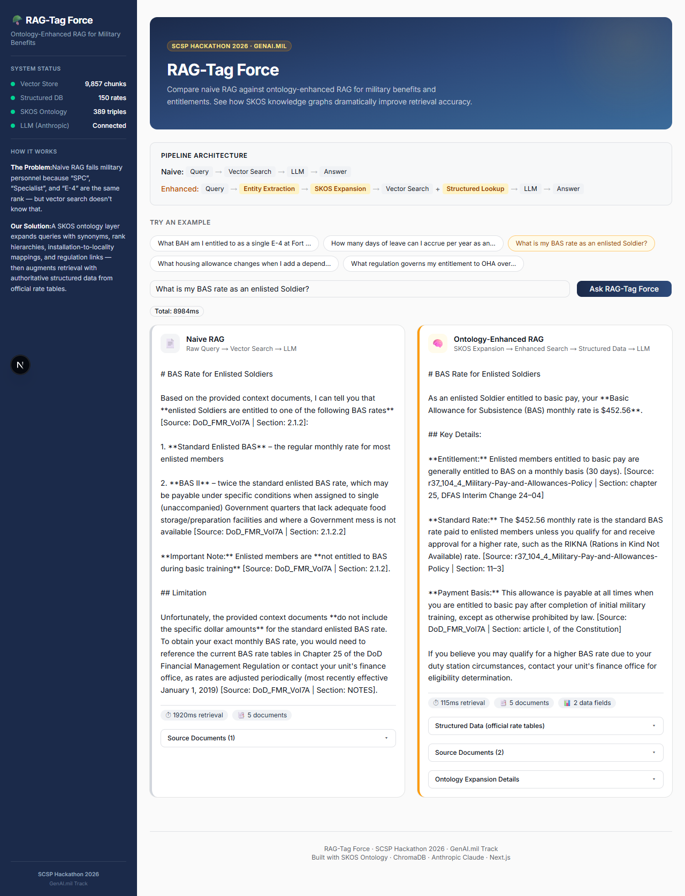

# RAG-Tag Force 🪖

> **Ontology-Enhanced RAG for Military Domains** — proving that a SKOS knowledge layer dramatically outperforms naive vector search in domain-specific retrieval.
>
> SCSP Hackathon 2026 · GenAI.mil Track



---

## Why Ontology-Enhanced RAG?

Standard RAG pipelines treat every query as a bag of tokens — they have no understanding of domain relationships. This fails in any specialized domain where **the same concept has many names** and where **authoritative structured data exists alongside unstructured documents**.

**The military domain makes this failure obvious:**

| What the user says | What basic RAG searches for | What the ontology knows |
|---|---|---|
| "E-4 at Fort Campbell" | Literal text "E-4" and "Fort Campbell" | E-4 = Specialist = SPC = Corporal = CPL → locality code `CLARKSVILLE_TN` |
| "per diem in Colorado Springs" | "per diem" near "Colorado Springs" | Colorado Springs → Fort Carson → Peterson SFB → `CO_SPRINGS_CO` → live GSA API lookup |
| "autonomous systems at Aberdeen" | "autonomous" near "Aberdeen" | Aberdeen = APG = Aberdeen Proving Ground → Maryland → NAICS 541715 (R&D) → USAspending API |

The ontology layer **expands** queries with synonyms, maps installations to locality codes, links allowances to governing regulations, and triggers structured data lookups — all before the vector store is ever queried. The result: answers with real dollar amounts, real contract data, and precise citations instead of vague summaries.

**This pattern is transferable.** Replace the military ontology with medical terminology (ICD-10 codes, drug brand/generic names) or legal citations (statute cross-references, jurisdiction mappings) and the same architecture delivers the same improvement. The ontology is the domain adapter.

---

## What the Demo Shows

Every query runs **two pipelines side by side**:

| | **Basic RAG** | **Ontology Enhanced RAG** |
|---|---|---|
| **Query** | Raw text → vector search | Text → entity extraction → SKOS expansion → enhanced search |
| **Data sources** | ChromaDB only | ChromaDB + SQLite + live APIs |
| **Synonyms** | None — misses alternate terms | All aliases from SKOS `altLabel` |
| **Structured data** | ❌ | ✅ BAH rates, pay tables, per diem, contract spending |
| **Citations** | Generic doc references | Regulation numbers, CRS report sections, API sources |

The delta between the two columns **is** the proof of value.

---

## Architecture

```
                         ┌─────────────────┐
                         │   User Query     │
                         └────────┬────────┘
                                  │
                    ┌─────────────┴─────────────┐
                    │                           │
             Basic RAG Path              Ontology Enhanced Path
                    │                           │
                    │                    ┌──────┴───────┐
                    │                    │ Entity        │
                    │                    │ Extraction    │
                    │                    └──────┬───────┘
                    │                           │
                    │                    ┌──────┴───────┐
                    │                    │ SKOS Ontology │
                    │                    │ Expansion     │
                    │                    │ (RDFLib)      │
                    │                    └──────┬───────┘
                    │                           │
                    │              ┌────────────┼────────────┐
                    │              │            │            │
               ┌────┴────┐  ┌─────┴─────┐ ┌───┴────┐ ┌────┴─────┐
               │ ChromaDB │  │ ChromaDB  │ │ SQLite │ │ Live APIs│
               │ Vector   │  │ Enhanced  │ │ Tables │ │ GSA/USAs │
               │ Search   │  │ Search    │ │        │ │ pending  │
               └────┬────┘  └─────┬─────┘ └───┬────┘ └────┬─────┘
                    │              └────────────┼───────────┘
                    │                          │
               ┌────┴────┐              ┌──────┴───────┐
               │  Claude  │              │   Claude     │
               │  Haiku   │              │   Haiku      │
               └────┬────┘              └──────┬───────┘
                    │                          │
               ┌────┴────┐              ┌──────┴───────┐
               │  Basic   │              │  Enhanced    │
               │  Answer  │              │  Answer      │
               └─────────┘              └──────────────┘
```

---

## System at a Glance

| Component | Count | Details |
|---|---|---|
| **Vector Store** | 10,281 chunks | 3 ChromaDB collections (benefits, TDY, contracts) |
| **Structured DB** | 342 rows | BAH rates, base pay, BAS, per diem tables |
| **SKOS Ontology** | 1,083 triples | 3 Turtle files covering all 3 domains |
| **Live APIs** | 2 connections | GSA Per Diem API · USAspending.gov API |
| **Test Suite** | 42 tests | Full coverage with pytest |
| **Domains** | 3 | Benefits & Entitlements · TDY Travel · Federal Contracts |

---

## Quick Start

### Prerequisites
- **Python 3.11+**
- **Node.js 18+** (for the frontend)
- [Anthropic API key](https://console.anthropic.com/) (Claude Haiku)

### 1. Clone & Install

```bash
git clone https://github.com/Marcus-Lind/ragtag-force.git
cd ragtag-force

# Python dependencies
pip install -r requirements.txt

# Frontend dependencies
cd frontend && npm install && cd ..
```

### 2. Configure Environment

```bash
cp .env.example .env
```

Edit `.env` and add your Anthropic API key:
```
ANTHROPIC_API_KEY=sk-ant-your-key-here
```

### 3. Ingest Data

```bash
# Military benefits (PDFs → 9,857 chunks + SQLite tables)
python scripts/ingest.py

# TDY travel (reference docs → 15 chunks)
python scripts/ingest_tdy.py

# Federal contracts (CRS reports, PDFs, HTML → 409 chunks)
python scripts/ingest_contracts.py
```

All scripts are **idempotent** — safe to run multiple times.

### 4. Run

```bash
# Start the API server (port 8000)
python -m uvicorn src.api.main:app --port 8000

# In another terminal — start the frontend (port 3000)
cd frontend && npm run dev
```

Open **http://localhost:3000** and try the example questions.

### One-Command Setup

```bash
python scripts/setup.py  # Installs deps, ingests data, validates
```

---

## The Three Domains

### 🎖️ Benefits & Entitlements

**What it proves:** Ontology expansion resolves rank synonyms (E-4 → SPC/Specialist/Corporal) and maps installations to BAH locality codes, then pulls exact dollar amounts from SQLite rate tables.

**Data sources:**
- 4 DoD regulation PDFs → 9,857 chunks
- SQLite: BAH rates (150 rows), enlisted pay (74), officer pay (90), BAS rates (2)
- SKOS ontology: 389 triples — ranks, allowances, installations, regulations

**Example questions:**
1. What BAH am I entitled to as a single E-4 at Fort Campbell?
2. How many days of leave can I accrue per year as an O-3?
3. What is my BAS rate as an enlisted Soldier?
4. What housing allowance changes when I add a dependent?
5. What regulation governs my entitlement to OHA overseas?

---

### ✈️ TDY Travel Planner

**What it proves:** Ontology maps installation nicknames (e.g., "Bragg" → Fort Liberty → Fayetteville, NC) to locality codes, then queries the **live GSA Per Diem API** for real-time lodging and meal rates.

**Data sources:**
- TDY reference documents → 15 chunks
- Live GSA Per Diem API (api.gsa.gov) — real-time rates
- SQLite: per diem rates (26 rows)
- SKOS ontology: 337 triples — installations, locations, travel regulations

**Example questions:**
1. What is the per diem rate for TDY to Fort Liberty?
2. How much lodging allowance do I get for TDY in Colorado Springs?
3. What are the meal rates for travel to the Pentagon?
4. Can I get reimbursed for a rental car on TDY to Fort Huachuca?
5. What is the per diem for TDY to Joint Base Lewis-McChord?

---

### 📊 Federal Contract Intelligence

**What it proves:** Ontology resolves domain terms (e.g., "autonomous systems" → NAICS codes, "Aberdeen" → APG → Maryland) and queries the **live USAspending.gov API** for real federal contract data — dollar amounts, contractors, and agencies.

**Data sources:**
- 7 CRS congressional reports (PDF + HTML from congress.gov) → 409 chunks
- Live USAspending.gov API — real contract spending data
- SKOS ontology: 357 triples — research domains, installations, contractors, NAICS codes

**Example questions:**
1. Find contracts for autonomous systems at Aberdeen Proving Ground
2. What are the largest defense AI contracts?
3. Find hypersonics research contracts in Alabama
4. Show me logistics and supply chain contracts at Fort Liberty
5. Who are the top contractors for cybersecurity?

---

## Project Structure

```
ragtag-force/
├── frontend/                  # Next.js 16 + shadcn/ui + Tailwind
│   └── src/
│       ├── app/page.tsx       # Main page — domain tabs, side-by-side answers
│       ├── components/        # Sidebar, AnswerCard, QueryInput, PipelineDiagram
│       └── lib/api.ts         # API client + TypeScript interfaces
│
├── src/
│   ├── api/main.py            # FastAPI backend — all domain endpoints
│   ├── config.py              # Environment config (paths, keys, model)
│   ├── ingest/                # Embeddings + ChromaDB vector store helpers
│   ├── llm/                   # Anthropic Claude client wrapper
│   ├── ontology/              # SKOS expanders (benefits, TDY, contracts)
│   └── retrieval/             # Retrieval pipelines (basic + enhanced per domain)
│
├── ontology/
│   ├── military_entitlements.ttl   # 389 triples — ranks, allowances, installations
│   ├── tdy_travel.ttl              # 337 triples — locations, per diem mappings
│   └── federal_contracts.ttl       # 357 triples — domains, contractors, NAICS
│
├── scripts/
│   ├── setup.py               # One-command setup (install + ingest + validate)
│   ├── ingest.py              # Benefits domain ingestion
│   ├── ingest_tdy.py          # TDY domain ingestion
│   └── ingest_contracts.py    # Contracts domain ingestion (MD + PDF + HTML)
│
├── data/
│   ├── chroma/                # ChromaDB persistent storage (3 collections)
│   ├── documents/contracts/   # CRS reports (PDF + HTML), reference docs (MD)
│   ├── raw/                   # Source PDFs for benefits domain
│   └── structured/            # SQLite databases (entitlements.db)
│
├── tests/                     # 42 pytest tests
├── requirements.txt           # Python dependencies
└── .env.example               # Environment template
```

---

## Tech Stack

| Layer | Technology |
|---|---|
| **LLM** | Anthropic Claude Haiku 4 |
| **Embeddings** | sentence-transformers (bge-base-en-v1.5, 768-dim) |
| **Vector Store** | ChromaDB (cosine similarity, persistent) |
| **Ontology** | RDFLib + SKOS (Turtle format) |
| **Structured Data** | SQLite via sqlite3 |
| **PDF Parsing** | PyMuPDF (fitz) |
| **Live APIs** | GSA Per Diem (api.gsa.gov) · USAspending (api.usaspending.gov) |
| **Backend** | FastAPI + Uvicorn |
| **Frontend** | Next.js 16 · shadcn/ui · Tailwind CSS v4 |
| **Testing** | pytest (42 tests) |

---

## Testing

```bash
python -m pytest tests/ -v
```

Tests cover ontology loading, entity extraction, query expansion, vector search, structured data lookups, and API response models.

---

## Datasets & Sources

| Source | What We Use |
|---|---|
| Army Publishing Directorate (armypubs.army.mil) | AR 37-104-4, AR 600-8-10 |
| DoD FMR Vol 7A (comptroller.defense.gov) | BAH, BAS, OHA chapters |
| Defense Travel Management Office (defensetravel.dod.mil) | BAH rate tables |
| DFAS (dfas.mil) | Military pay charts |
| Congressional Research Service (crsreports.congress.gov) | 7 CRS reports on AI, cyber, defense industrial base, hypersonics, autonomous weapons |
| GSA Per Diem API (api.gsa.gov) | Live per diem rates |
| USAspending.gov API | Live federal contract data |

---

## Team

**RAG-Tag Force** · SCSP Hackathon 2026 · GenAI.mil Track
